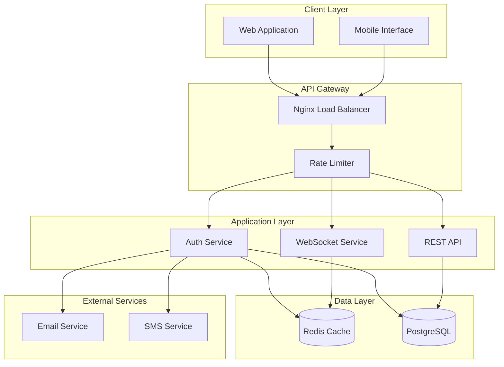
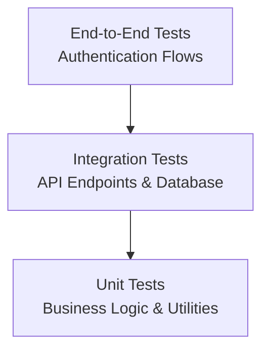

# Design Document - Confirmelo Authentication System

## Overview

The Confirmelo Authentication System is designed as a secure, scalable, and enterprise-grade authentication and authorization platform for a multi-tenant SaaS e-commerce order confirmation system. The system supports a complex multi-role ecosystem with real-time capabilities, serving up to 40 internal users and 50+ client organizations annually.

### Key Design Principles

- **Security First**: Enterprise-grade security with comprehensive audit trails and threat protection
- **Real-time Capabilities**: WebSocket-based real-time features with seamless session management
- **Multi-tenant Architecture**: Support for multiple client organizations with resource-level isolation
- **Role-based Access Control**: Granular permissions with six distinct user roles
- **Scalability**: Horizontally scalable design supporting business growth
- **Developer Experience**: Type-safe, maintainable codebase with comprehensive testing

## Architecture

### High-Level Architecture



### Technology Stack

- **Backend**: NestJS with TypeScript (enterprise-grade framework)
- **Frontend**: Next.js 14 with App Router and TypeScript
- **Database**: PostgreSQL 15+ with Prisma ORM
- **Cache/Session Store**: Redis with clustering support
- **Real-time**: WebSocket with Socket.io
- **Authentication**: JWT tokens with refresh token rotation
- **Security**: Helmet.js, bcrypt, rate limiting, Passport.js
- **UI Components**: Shadcn/ui with Tailwind CSS
- **Internationalization**: i18next (English/French support)
- **Containerization**: Docker with multi-stage builds
- **Monitoring**: Winston logging with structured events

## Components and Interfaces

### 1. Authentication Service

**Purpose**: Core authentication logic including login, registration, and token management.

**Key Responsibilities**:
- User registration and organization setup
- Credential validation and authentication
- JWT token generation and refresh
- Password security and reset functionality
- Security event logging

**Interfaces**:
```typescript
interface AuthService {
  register(orgData: OrganizationRegistration, adminData: UserRegistration): Promise<AuthResult>
  login(credentials: LoginCredentials): Promise<AuthResult>
  refreshToken(refreshToken: string): Promise<TokenPair>
  resetPassword(email: string): Promise<void>
  changePassword(userId: string, oldPassword: string, newPassword: string): Promise<void>
}

interface AuthResult {
  user: User
  tokens: TokenPair
  sessionId: string
}

interface TokenPair {
  accessToken: string  // 15 minutes
  refreshToken: string // 7 days (30 days with "remember me")
}
```

### 2. Authorization Service

**Purpose**: Role-based access control with granular permissions and resource-level security.

**Key Responsibilities**:
- Role and permission management
- Resource-level access control
- Store/team/client assignment validation
- Permission caching and real-time updates

**Role Hierarchy** (aligned with Prisma schema):
- **SUPER_ADMIN**: System-wide administrative access
- **ADMIN**: Full system access, organization management
- **TEAM_LEADER**: Assigned team scope, store management
- **CALL_CENTER_AGENT**: Order confirmation interface access
- **FOLLOWUP_AGENT**: Reminder management capabilities
- **CLIENT_ADMIN**: Organization management for client
- **CLIENT_USER**: Read-only access to organization data

**Interfaces**:
```typescript
interface AuthorizationService {
  checkPermission(userId: string, resource: string, action: string): Promise<boolean>
  getUserPermissions(userId: string): Promise<Permission[]>
  updateUserRole(userId: string, role: Role, assignments: Assignment[]): Promise<void>
  validateResourceAccess(userId: string, resourceId: string, resourceType: string): Promise<boolean>
}

interface Permission {
  resource: string
  actions: string[]
  scope: ResourceScope
}

interface ResourceScope {
  organizationId?: string
  storeIds?: string[]
  teamIds?: string[]
  clientIds?: string[]
}
```

### 3. Session Management Service

**Purpose**: Redis-based session management with WebSocket integration.

**Key Responsibilities**:
- Session creation and validation
- WebSocket connection management
- Multi-session support per user
- Session cleanup and expiration

**Interfaces**:
```typescript
interface SessionService {
  createSession(userId: string, sessionData: SessionData): Promise<string>
  getSession(sessionId: string): Promise<SessionData | null>
  updateSession(sessionId: string, updates: Partial<SessionData>): Promise<void>
  invalidateSession(sessionId: string): Promise<void>
  getUserSessions(userId: string): Promise<SessionData[]>
}

interface SessionData {
  userId: string
  organizationId: string
  role: Role
  permissions: Permission[]
  assignments: Assignment[]
  websocketId?: string
  lastActivity: Date
  ipAddress: string
  userAgent: string
}
```

### 4. WebSocket Service

**Purpose**: Real-time communication for order updates and system notifications.

**Key Responsibilities**:
- WebSocket connection management
- Real-time permission updates
- Order status notifications
- System-wide announcements

**Interfaces**:
```typescript
interface WebSocketService {
  handleConnection(socket: Socket, sessionId: string): Promise<void>
  broadcastToUser(userId: string, event: string, data: any): Promise<void>
  broadcastToRole(role: Role, event: string, data: any): Promise<void>
  updateUserPermissions(userId: string, permissions: Permission[]): Promise<void>
}
```

### 5. Security Service

**Purpose**: Comprehensive security measures including threat detection and audit logging.

**Key Responsibilities**:
- Password strength validation and hashing
- Rate limiting and brute force protection
- Security event logging
- Threat detection and response

**Interfaces**:
```typescript
interface SecurityService {
  hashPassword(password: string): Promise<string>
  validatePassword(password: string, hash: string): Promise<boolean>
  validatePasswordStrength(password: string): PasswordStrengthResult
  logSecurityEvent(event: SecurityEvent): Promise<void>
  checkRateLimit(identifier: string, action: string): Promise<boolean>
  detectThreat(request: Request): Promise<ThreatLevel>
}

interface SecurityEvent {
  type: 'LOGIN_SUCCESS' | 'LOGIN_FAILURE' | 'PASSWORD_RESET' | 'PERMISSION_CHANGE'
  userId?: string
  ipAddress: string
  userAgent: string
  details: Record<string, any>
  timestamp: Date
}
```

## Data Models

### Core Entities

```typescript
// Organization Entity (aligned with Prisma schema)
interface Organization {
  id: string
  name: string
  code: string
  logo?: string
  website?: string
  phone?: string
  email: string
  address?: string
  city?: string
  country: string
  timezone: string
  currency: Currency
  taxId?: string
  billingEmail?: string
  createdAt: Date
  updatedAt: Date
  deletedAt?: Date
}

// User Entity (aligned with Prisma schema)
interface User {
  id: string
  email: string
  username: string
  password: string
  firstName: string
  lastName: string
  phone?: string
  avatar?: string
  role: UserRole
  status: UserStatus
  isOnline: boolean
  lastActiveAt?: Date
  organizationId?: string
  createdAt: Date
  updatedAt: Date
  deletedAt?: Date
  
  // Relationships
  organization?: Organization
  leadingTeams: Team[]
  teamMemberships: TeamMember[]
  assignedOrders: Order[]
  sessions: Session[]
}

// Team Entity (for resource-level access)
interface Team {
  id: string
  name: string
  description?: string
  organizationId: string
  leaderId: string
  createdAt: Date
  updatedAt: Date
  deletedAt?: Date
  
  // Relationships
  organization: Organization
  leader: User
  members: TeamMember[]
  storeAssignments: TeamStore[]
}

// Session Entity (aligned with Prisma schema)
interface Session {
  id: string
  sessionToken: string
  userId: string
  expiresAt: Date
  ipAddress?: string
  userAgent?: string
  createdAt: Date
  
  // Relationships
  user: User
}

// Audit Log Entity (aligned with Prisma schema)
interface AuditLog {
  id: string
  userId?: string
  organizationId?: string
  action: string
  entityType: string
  entityId: string
  previousValue?: Json
  newValue?: Json
  ipAddress?: string
  userAgent?: string
  createdAt: Date
}
```

### Database Schema Design Decisions

1. **UUID Primary Keys**: For security and scalability across distributed systems
2. **Soft Deletes**: Maintain audit trails and data integrity
3. **Indexing Strategy**: Composite indexes on frequently queried combinations (userId + organizationId, email + organizationId)
4. **Partitioning**: Security logs partitioned by date for performance
5. **Connection Pooling**: Prisma connection pooling with read replicas for scalability

## Error Handling

### Error Classification

```typescript
enum ErrorType {
  AUTHENTICATION_ERROR = 'AUTHENTICATION_ERROR',
  AUTHORIZATION_ERROR = 'AUTHORIZATION_ERROR',
  VALIDATION_ERROR = 'VALIDATION_ERROR',
  RATE_LIMIT_ERROR = 'RATE_LIMIT_ERROR',
  SYSTEM_ERROR = 'SYSTEM_ERROR'
}

interface ApiError {
  type: ErrorType
  message: string
  code: string
  correlationId: string
  details?: Record<string, any>
}
```

### Error Handling Strategy

1. **Structured Error Responses**: Consistent error format across all endpoints
2. **Correlation IDs**: Unique identifiers for request tracing and debugging
3. **Sanitized Messages**: User-friendly messages without sensitive information
4. **Comprehensive Logging**: Detailed internal logging with context
5. **Graceful Degradation**: Fallback mechanisms for non-critical failures

### Security-Specific Error Handling

- **Generic Authentication Errors**: Prevent user enumeration attacks
- **Rate Limiting**: Progressive delays with clear messaging
- **Session Errors**: Automatic cleanup and secure redirects
- **Permission Errors**: Minimal information disclosure

## Testing Strategy

### Test Pyramid Structure



### Testing Approach

1. **Unit Tests (70%)**
   - Authentication service logic
   - Password validation and hashing
   - Permission calculation
   - Token generation and validation
   - Security utilities

2. **Integration Tests (20%)**
   - API endpoint testing with test database
   - Redis session management
   - WebSocket connection handling
   - Email service integration
   - Database operations with Prisma

3. **End-to-End Tests (10%)**
   - Complete authentication flows
   - Role-based access scenarios
   - Multi-session management
   - Security threat simulation
   - Cross-browser compatibility

### Test Data Management

- **Test Fixtures**: Predefined user roles and organizations
- **Database Seeding**: Automated test data setup and teardown
- **Mock Services**: External service mocking (email, SMS)
- **Security Testing**: Automated vulnerability scanning

### Performance Testing

- **Load Testing**: Authentication endpoints under high concurrency
- **Stress Testing**: System behavior under extreme load
- **WebSocket Testing**: Real-time connection scalability
- **Database Performance**: Query optimization validation

## Security Considerations

### Authentication Security

1. **Password Security**
   - bcrypt hashing with configurable salt rounds (minimum 12)
   - Password strength validation with real-time feedback
   - Protection against common password lists
   - Secure password reset with time-limited tokens

2. **Token Security**
   - Short-lived access tokens (15 minutes)
   - Refresh token rotation on each use
   - Secure token storage and transmission
   - Token blacklisting for immediate revocation

3. **Session Security**
   - Redis-based session storage with encryption
   - Session fixation protection
   - Concurrent session management
   - Automatic session cleanup

### API Security

1. **Request Security**
   - Comprehensive security headers (Helmet.js)
   - HTTPS enforcement
   - Content Security Policy (CSP)
   - CORS configuration with whitelisted origins

2. **Rate Limiting**
   - Intelligent rate limiting with Redis backend (10 requests/minute for auth endpoints)
   - Progressive delays for failed attempts (1s, 2s, 4s, 8s progression)
   - IP-based and user-based limits with sliding window algorithm
   - Account lockout after 5 failed attempts with exponential backoff
   - Administrator notifications for potential brute force attacks

3. **Input Validation**
   - Comprehensive input sanitization
   - SQL injection prevention
   - XSS protection
   - CSRF protection

### Monitoring and Alerting

1. **Security Monitoring**
   - Real-time threat detection
   - Brute force attack monitoring
   - Suspicious activity alerts
   - Automated response mechanisms

2. **Audit Logging**
   - Comprehensive security event logging
   - Immutable audit trails
   - Correlation ID tracking
   - Compliance reporting capabilities

## Scalability and Performance

### Horizontal Scaling Design

1. **Stateless Application Design**
   - Session externalization to Redis
   - JWT token-based authentication
   - Load balancer compatibility
   - Container orchestration ready

2. **Database Scaling**
   - Read replica support
   - Connection pooling optimization
   - Query performance monitoring
   - Automated migration management

3. **Caching Strategy**
   - Redis clustering for high availability
   - Permission caching with TTL
   - Session data optimization
   - Rate limiting data management

### Performance Optimizations

1. **Database Optimizations**
   - Strategic indexing for common queries
   - Query optimization with Prisma
   - Connection pool tuning
   - Database monitoring and alerting

2. **API Performance**
   - Response time monitoring
   - Efficient serialization
   - Compression middleware
   - CDN integration for static assets

3. **Real-time Performance**
   - WebSocket connection pooling
   - Efficient event broadcasting
   - Connection state management
   - Graceful degradation strategies

## Frontend Architecture & User Experience

### Next.js 14 Implementation

**App Router Structure**:
- Route groups for authentication flows: `(auth)/login`, `(auth)/register`
- Protected dashboard routes with role-based layouts
- Server components for optimal performance and SEO
- Client components for interactive authentication features

**Component Architecture**:
```typescript
// Authentication Components
interface AuthFormProps {
  onSubmit: (data: LoginCredentials | RegisterData) => Promise<void>
  loading: boolean
  error?: string
}

// Layout Components
interface DashboardLayoutProps {
  user: User
  permissions: Permission[]
  children: React.ReactNode
}
```

### Internationalization (i18next)

**Language Support**:
- English (default): Complete coverage for all authentication flows
- French: Full translation for international market expansion
- Dynamic language switching without page refresh
- Localized error messages and validation feedback

**Implementation Strategy**:
```typescript
// Translation namespace organization
interface AuthTranslations {
  login: {
    title: string
    email: string
    password: string
    rememberMe: string
    submit: string
    forgotPassword: string
  }
  register: {
    organizationDetails: string
    adminDetails: string
    submit: string
    success: string
  }
  errors: {
    invalidCredentials: string
    accountLocked: string
    sessionExpired: string
  }
}
```

### Responsive Design & Accessibility

**Mobile-First Approach**:
- Touch-optimized interfaces for mobile agent productivity
- Responsive breakpoints: mobile (320px+), tablet (768px+), desktop (1024px+)
- Progressive Web App capabilities for offline authentication
- Native-like experience with smooth transitions

**Accessibility Features**:
- WCAG 2.1 AA compliance for all authentication interfaces
- Screen reader support with proper ARIA labels
- Keyboard navigation for all interactive elements
- High contrast mode support
- Focus management for form interactions

**UI/UX Design Principles**:
- Clean, minimalist design with Confirmelo branding
- Real-time validation feedback with clear error messages
- Password strength indicators with visual feedback
- Loading states and progress indicators
- Consistent design patterns using Shadcn/ui components

## Deployment and Operations

### Containerization Strategy

1. **Docker Configuration**
   - Multi-stage builds for optimization
   - Security-hardened base images
   - Health check implementations
   - Environment-specific configurations

2. **Orchestration**
   - Kubernetes deployment manifests
   - Service mesh integration
   - Auto-scaling configurations
   - Rolling update strategies

### Monitoring and Observability

1. **Application Monitoring**
   - Structured logging with Winston
   - Performance metrics collection
   - Error tracking and alerting
   - Health check endpoints

2. **Infrastructure Monitoring**
   - Container resource monitoring
   - Database performance tracking
   - Redis cluster monitoring
   - Network performance analysis

### Backup and Recovery

1. **Data Backup**
   - Automated PostgreSQL backups
   - Redis persistence configuration
   - Cross-region backup replication
   - Point-in-time recovery capability

2. **Disaster Recovery**
   - Multi-region deployment strategy
   - Automated failover mechanisms
   - Data consistency validation
   - Recovery time optimization