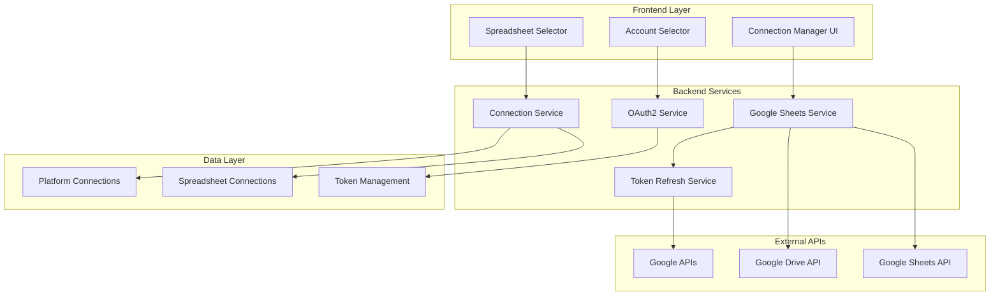
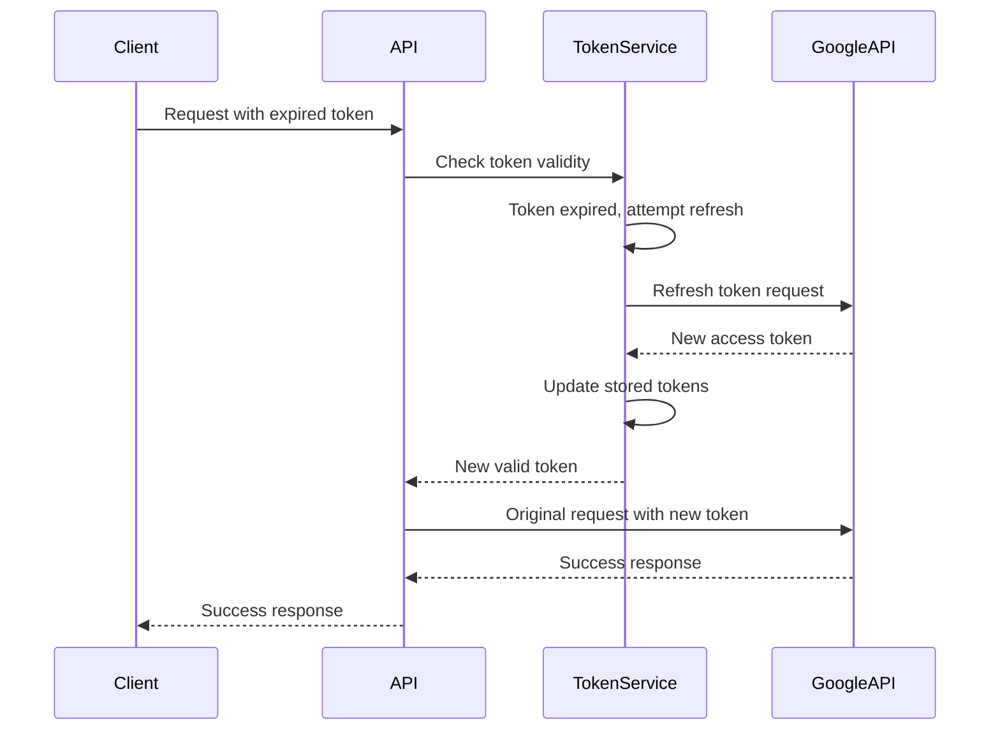

# Design Document

## Overview

This design document outlines the technical approach to enhance the Google Sheets integration by addressing token expiration issues, enabling multiple spreadsheet connections per account, and supporting multiple Google account connections simultaneously.

The solution involves:
1. **Automatic Token Refresh Mechanism**: Implementing proactive token refresh with proper error handling
2. **Multi-Spreadsheet Connection Model**: Extending the data model to support multiple spreadsheets per connection
3. **Multi-Account Support**: Removing the unique constraint that prevents multiple Google account connections
4. **Enhanced UI Components**: Updating frontend components to manage multiple connections and spreadsheets
5. **Backward Compatibility**: Ensuring existing connections continue to work seamlessly

## Architecture

### High-Level Architecture



### Token Management Flow



## Components and Interfaces

### 1. Enhanced OAuth2 Service

**Purpose**: Handle automatic token refresh and multi-account authentication

**Key Methods**:
```typescript
interface EnhancedOAuth2Service {
  // Existing methods enhanced
  getAccessToken(connectionId: string): Promise<string>
  refreshAccessToken(connectionId: string): Promise<OAuth2TokenResponse>
  
  // New methods for multi-account support
  initiateGoogleAuthorization(userId: string, organizationId: string, accountLabel?: string): Promise<AuthorizationRequest>
  validateAndRefreshToken(connectionId: string): Promise<boolean>
  scheduleTokenRefresh(connectionId: string): void
}
```

**Token Refresh Strategy**:
- Proactive refresh when token has less than 10 minutes remaining
- Automatic retry with exponential backoff on refresh failures
- Graceful degradation to expired status when refresh tokens are invalid

### 2. Multi-Spreadsheet Connection Service

**Purpose**: Manage multiple spreadsheet connections per Google account

**Data Model Enhancement**:
```typescript
interface SpreadsheetConnection {
  id: string
  connectionId: string  // References PlatformConnection
  spreadsheetId: string
  spreadsheetName: string
  connectedAt: Date
  lastAccessedAt: Date
  isActive: boolean
  sheets: SpreadsheetSheet[]
}

interface SpreadsheetSheet {
  sheetId: number
  name: string
  index: number
  rowCount: number
  columnCount: number
}
```

**Key Methods**:
```typescript
interface SpreadsheetConnectionService {
  connectSpreadsheet(connectionId: string, spreadsheetId: string): Promise<SpreadsheetConnection>
  disconnectSpreadsheet(connectionId: string, spreadsheetId: string): Promise<void>
  listConnectedSpreadsheets(connectionId: string): Promise<SpreadsheetConnection[]>
  getSpreadsheetConnection(connectionId: string, spreadsheetId: string): Promise<SpreadsheetConnection>
  refreshSpreadsheetInfo(connectionId: string, spreadsheetId: string): Promise<SpreadsheetConnection>
}
```

### 3. Enhanced Google Sheets Service

**Purpose**: Coordinate operations across multiple spreadsheets and accounts

**Key Enhancements**:
- Automatic token validation before API calls
- Context-aware spreadsheet operations
- Multi-account spreadsheet listing
- Improved error handling with recovery suggestions

**Updated Methods**:
```typescript
interface EnhancedGoogleSheetsService {
  // Enhanced with automatic token refresh
  listSpreadsheets(connectionId: string, pageSize?: number, pageToken?: string): Promise<SpreadsheetListResponse>
  createSpreadsheet(connectionId: string, title: string, sheets?: SheetConfig[]): Promise<GoogleSpreadsheet>
  
  // New multi-spreadsheet methods
  connectToSpreadsheet(connectionId: string, spreadsheetId: string): Promise<SpreadsheetConnection>
  disconnectFromSpreadsheet(connectionId: string, spreadsheetId: string): Promise<void>
  getConnectedSpreadsheets(connectionId: string): Promise<SpreadsheetConnection[]>
  
  // Enhanced operations with connection context
  performSpreadsheetOperation(connectionId: string, spreadsheetId: string, operation: SpreadsheetOperation): Promise<any>
}
```

### 4. Database Schema Changes

**New Table: spreadsheet_connections**
```sql
CREATE TABLE spreadsheet_connections (
  id VARCHAR(30) PRIMARY KEY,
  connection_id VARCHAR(30) NOT NULL REFERENCES platform_connections(id) ON DELETE CASCADE,
  spreadsheet_id VARCHAR(100) NOT NULL,
  spreadsheet_name VARCHAR(255) NOT NULL,
  connected_at TIMESTAMP NOT NULL DEFAULT NOW(),
  last_accessed_at TIMESTAMP,
  is_active BOOLEAN NOT NULL DEFAULT TRUE,
  sheets_data JSONB,
  created_at TIMESTAMP NOT NULL DEFAULT NOW(),
  updated_at TIMESTAMP NOT NULL DEFAULT NOW(),
  
  UNIQUE(connection_id, spreadsheet_id),
  INDEX(connection_id),
  INDEX(spreadsheet_id),
  INDEX(is_active)
);
```

**Modified Table: platform_connections**
```sql
-- Remove unique constraint to allow multiple Google accounts
ALTER TABLE platform_connections 
DROP CONSTRAINT platform_connections_userId_platformType_platformStoreId_key;

-- Add new unique constraint that allows multiple Google accounts
ALTER TABLE platform_connections 
ADD CONSTRAINT platform_connections_unique_per_account 
UNIQUE(userId, platformType, platformData->>'google_email');

-- Add index for better performance
CREATE INDEX idx_platform_connections_google_email 
ON platform_connections USING GIN ((platformData->>'google_email'));
```

### 5. Frontend Component Architecture

**Enhanced Connection Manager**
```typescript
interface ConnectionManagerProps {
  // Support for multiple Google accounts
  groupByAccount?: boolean
  showAccountSelector?: boolean
  allowMultipleAccounts?: boolean
}

interface GoogleAccountGroup {
  email: string
  connections: PlatformConnection[]
  totalSpreadsheets: number
  lastSyncAt: Date
}
```

**Multi-Spreadsheet Selector**
```typescript
interface MultiSpreadsheetSelectorProps {
  connectionId: string
  selectedSpreadsheets: string[]
  onSpreadsheetToggle: (spreadsheetId: string, selected: boolean) => void
  onSpreadsheetCreate: (spreadsheet: CreateSpreadsheetRequest) => void
  maxSelections?: number
}
```

**Account Selector Component**
```typescript
interface AccountSelectorProps {
  availableAccounts: GoogleAccount[]
  selectedAccountId?: string
  onAccountSelect: (accountId: string) => void
  onAddAccount: () => void
  showAddAccountOption?: boolean
}
```

## Data Models

### Enhanced Platform Connection Model

```typescript
interface EnhancedPlatformConnection {
  id: string
  platformType: PlatformType
  platformName: string  // Now includes account email for Google accounts
  status: ConnectionStatus
  
  // OAuth2 credentials
  accessToken: string  // Encrypted
  refreshToken: string  // Encrypted
  tokenExpiresAt: Date
  
  // Enhanced platform data
  platformData: {
    google_user_id: string
    google_email: string  // Used for account identification
    google_name: string
    google_picture?: string
    account_label?: string  // User-defined label
    connected_spreadsheets_count: number
    last_token_refresh: Date
  }
  
  // Connection metadata
  scopes: string[]
  userId: string
  organizationId: string
  lastSyncAt: Date
  lastErrorAt?: Date
  lastErrorMessage?: string
  syncCount: number
  
  // Timestamps
  createdAt: Date
  updatedAt: Date
  
  // Related data
  connectedSpreadsheets?: SpreadsheetConnection[]
}
```

### Spreadsheet Connection Model

```typescript
interface SpreadsheetConnection {
  id: string
  connectionId: string
  spreadsheetId: string
  spreadsheetName: string
  connectedAt: Date
  lastAccessedAt?: Date
  isActive: boolean
  
  // Spreadsheet metadata
  sheets: SpreadsheetSheet[]
  permissions: SpreadsheetPermissions
  webViewLink: string
  
  // Sync information
  lastSyncAt?: Date
  syncCount: number
  lastErrorAt?: Date
  lastErrorMessage?: string
  
  // Timestamps
  createdAt: Date
  updatedAt: Date
}

interface SpreadsheetSheet {
  sheetId: number
  name: string
  index: number
  rowCount: number
  columnCount: number
  gridProperties: {
    frozenRowCount?: number
    frozenColumnCount?: number
  }
}

interface SpreadsheetPermissions {
  canEdit: boolean
  canShare: boolean
  canComment: boolean
  role: 'owner' | 'editor' | 'commenter' | 'viewer'
}
```

## Error Handling

### Token Refresh Error Handling

```typescript
enum TokenRefreshError {
  REFRESH_TOKEN_EXPIRED = 'refresh_token_expired',
  REFRESH_TOKEN_REVOKED = 'refresh_token_revoked',
  NETWORK_ERROR = 'network_error',
  INVALID_GRANT = 'invalid_grant',
  RATE_LIMITED = 'rate_limited'
}

interface TokenRefreshResult {
  success: boolean
  error?: TokenRefreshError
  newTokenExpiresAt?: Date
  requiresReauth: boolean
  retryAfter?: number  // For rate limiting
}
```

### Connection Error Recovery

```typescript
interface ConnectionRecoveryStrategy {
  errorType: string
  recoveryAction: 'retry' | 'reauth' | 'manual' | 'ignore'
  userMessage: string
  technicalDetails?: string
  retryDelay?: number
  maxRetries?: number
}

const ERROR_RECOVERY_STRATEGIES: Record<string, ConnectionRecoveryStrategy> = {
  'token_expired': {
    errorType: 'token_expired',
    recoveryAction: 'retry',
    userMessage: 'Refreshing your authentication...',
    retryDelay: 1000,
    maxRetries: 3
  },
  'refresh_token_expired': {
    errorType: 'refresh_token_expired',
    recoveryAction: 'reauth',
    userMessage: 'Please re-authenticate your Google account to continue.',
    technicalDetails: 'Your refresh token has expired and needs to be renewed.'
  },
  'spreadsheet_not_found': {
    errorType: 'spreadsheet_not_found',
    recoveryAction: 'manual',
    userMessage: 'The spreadsheet may have been deleted or access revoked.',
    technicalDetails: 'Spreadsheet ID not found or access denied.'
  }
}
```

## Testing Strategy

### Unit Testing

1. **Token Refresh Logic**
   - Test automatic refresh triggers
   - Test refresh failure scenarios
   - Test token expiration edge cases

2. **Multi-Spreadsheet Operations**
   - Test connecting/disconnecting spreadsheets
   - Test spreadsheet listing with multiple connections
   - Test concurrent operations on different spreadsheets

3. **Multi-Account Management**
   - Test account isolation
   - Test account-specific operations
   - Test account deletion scenarios

### Integration Testing

1. **End-to-End Authentication Flow**
   - Test multiple account authentication
   - Test token refresh during operations
   - Test connection recovery scenarios

2. **Spreadsheet Operations**
   - Test operations across multiple spreadsheets
   - Test operations across multiple accounts
   - Test error handling and recovery

3. **UI Component Testing**
   - Test multi-account connection manager
   - Test spreadsheet selector with multiple sheets
   - Test account switching functionality

### Performance Testing

1. **Token Refresh Performance**
   - Test refresh latency impact
   - Test concurrent refresh operations
   - Test refresh queue management

2. **Multi-Spreadsheet Scalability**
   - Test with large numbers of connected spreadsheets
   - Test spreadsheet listing performance
   - Test concurrent spreadsheet operations

## Migration Strategy

### Database Migration

1. **Phase 1: Schema Updates**
   - Create `spreadsheet_connections` table
   - Update `platform_connections` constraints
   - Add necessary indexes

2. **Phase 2: Data Migration**
   - Migrate existing single-spreadsheet connections
   - Create spreadsheet connection records for existing connections
   - Update platform data with account information

3. **Phase 3: Cleanup**
   - Remove deprecated fields
   - Optimize indexes
   - Update foreign key constraints

### Application Migration

1. **Backward Compatibility Layer**
   - Maintain existing API endpoints
   - Add compatibility wrappers for old client code
   - Gradual deprecation of old patterns

2. **Feature Flag Rollout**
   - Enable multi-account support gradually
   - Monitor performance and error rates
   - Rollback capability for critical issues

3. **User Communication**
   - Notify users of enhanced capabilities
   - Provide migration guides for existing integrations
   - Support documentation updates

## Security Considerations

### Token Security

1. **Enhanced Encryption**
   - Use stronger encryption for stored tokens
   - Implement token rotation policies
   - Add token integrity verification

2. **Access Control**
   - Verify account ownership before operations
   - Implement proper authorization checks
   - Add audit logging for sensitive operations

### Multi-Account Isolation

1. **Account Separation**
   - Ensure complete isolation between accounts
   - Prevent cross-account data leakage
   - Validate account context in all operations

2. **Permission Validation**
   - Verify spreadsheet access permissions
   - Check account-level permissions
   - Implement proper scope validation

## Performance Optimizations

### Token Management

1. **Proactive Refresh**
   - Refresh tokens before expiration
   - Batch refresh operations
   - Cache token status to reduce database queries

2. **Connection Pooling**
   - Reuse HTTP connections to Google APIs
   - Implement connection pooling for database
   - Optimize API call patterns

### Multi-Spreadsheet Operations

1. **Caching Strategy**
   - Cache spreadsheet metadata
   - Implement intelligent cache invalidation
   - Use Redis for distributed caching

2. **Batch Operations**
   - Group related API calls
   - Implement batch spreadsheet operations
   - Optimize database queries with proper indexing

This design provides a comprehensive solution to address all three identified issues while maintaining backward compatibility and ensuring robust error handling and performance.