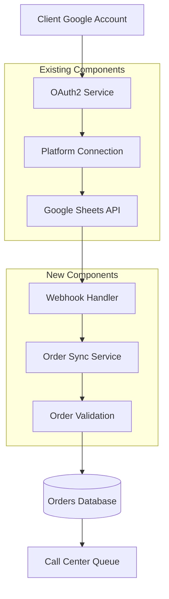

# Design Document

## Overview

The Google Sheets Order Sync feature extends the existing Confirmelo platform to support Google Sheets as an order source alongside Youcan and Shopify. This feature enables clients to connect their Google accounts directly to the app, create standardized order sheets, and sync orders in real-time using webhooks. The system leverages the existing Google Sheets OAuth2 integration and extends it with order-specific functionality, webhook management, and real-time synchronization capabilities.

## Architecture

### High-Level Architecture



### System Integration Points

The feature integrates with existing Confirmelo components:

1. **Google Sheets OAuth2 Service**: Extends existing authentication to support order sheet creation
2. **Platform Connection Management**: Leverages existing connection storage and management
3. **Order Management System**: Integrates with existing order creation and workflow
4. **Organization & Client Management**: Uses existing multi-tenant architecture
5. **WebSocket System**: Extends real-time notifications for sync status

## Components and Interfaces

### 1. Google Sheets Order Service

**Purpose**: Manages order sheet creation, configuration, and data operations

**Key Methods**:
```typescript
interface GoogleSheetsOrderService {
  createOrderSheet(connectionId: string, sheetName: string): Promise<OrderSheetInfo>
  setupOrderSheetStructure(spreadsheetId: string, accessToken: string): Promise<void>
  getOrdersFromSheet(connectionId: string, spreadsheetId: string, lastSyncRow?: number): Promise<SheetOrder[]>
  updateSheetWithOrderIds(connectionId: string, spreadsheetId: string, updates: OrderUpdate[]): Promise<void>
  validateSheetStructure(spreadsheetId: string, accessToken: string): Promise<ValidationResult>
}
```

**Integration Points**:
- Extends existing `GoogleSheetsOAuth2Service`
- Uses existing spreadsheet connection management
- Integrates with `SpreadsheetConnectionService`

### 2. Order Sync Service

**Purpose**: Handles the synchronization logic between Google Sheets and the order database

**Key Methods**:
```typescript
interface OrderSyncService {
  syncOrdersFromSheet(connectionId: string, spreadsheetId: string): Promise<SyncResult>
  processSheetOrder(sheetOrder: SheetOrder, organizationId: string): Promise<Order>
  handleDuplicateOrder(order: Order, existingOrder: Order): Promise<DuplicateResolution>
  validateOrderData(sheetOrder: SheetOrder, organization: Organization): Promise<ValidationResult>
  createOrderFromSheetData(sheetOrder: SheetOrder, organizationId: string): Promise<Order>
}
```

**Integration Points**:
- Uses existing Order model and creation logic
- Integrates with Customer management
- Uses existing Product catalog
- Leverages Organization settings

### 3. Webhook Management Service

**Purpose**: Manages Google Sheets webhook subscriptions for real-time sync

**Key Methods**:
```typescript
interface WebhookManagementService {
  setupWebhookForSheet(connectionId: string, spreadsheetId: string): Promise<WebhookSubscription>
  handleWebhookNotification(notification: GoogleSheetsWebhook): Promise<void>
  renewWebhookSubscription(subscriptionId: string): Promise<void>
  removeWebhookSubscription(subscriptionId: string): Promise<void>
  validateWebhookSignature(payload: string, signature: string): boolean
}
```

**New Component**: Requires implementation of webhook endpoint and subscription management

### 4. Order Validation Service

**Purpose**: Validates order data from sheets against business rules and client requirements

**Key Methods**:
```typescript
interface OrderValidationService {
  validateRequiredFields(sheetOrder: SheetOrder): ValidationResult
  validatePhoneNumber(phone: string, organization: Organization): ValidationResult
  validateProduct(productName: string, organizationId: string): Promise<ProductValidationResult>
  validatePrice(price: string, currency: Currency): ValidationResult
  validateAddress(address: SheetOrderAddress): ValidationResult
}
```

**Integration Points**:
- Uses existing Product catalog
- Integrates with Organization settings
- Leverages existing validation utilities

### 5. Sync Status Service

**Purpose**: Tracks and manages sync operations, errors, and status reporting

**Key Methods**:
```typescript
interface SyncStatusService {
  recordSyncOperation(connectionId: string, operation: SyncOperation): Promise<void>
  getSyncStatus(connectionId: string): Promise<SyncStatus>
  recordSyncError(connectionId: string, error: SyncError): Promise<void>
  getRecentSyncHistory(organizationId: string): Promise<SyncHistory[]>
  retrySyncOperation(operationId: string): Promise<SyncResult>
}
```

**New Component**: Requires new database tables for sync tracking

## Data Models

### Extended Database Schema

```sql
-- Extend existing SpreadsheetConnection table
ALTER TABLE "SpreadsheetConnection" ADD COLUMN "isOrderSync" BOOLEAN DEFAULT false;
ALTER TABLE "SpreadsheetConnection" ADD COLUMN "orderSyncConfig" JSONB;
ALTER TABLE "SpreadsheetConnection" ADD COLUMN "lastSyncRow" INTEGER DEFAULT 1;
ALTER TABLE "SpreadsheetConnection" ADD COLUMN "webhookSubscriptionId" VARCHAR(255);

-- New table for webhook subscriptions
CREATE TABLE "WebhookSubscription" (
  "id" TEXT PRIMARY KEY,
  "connectionId" TEXT NOT NULL,
  "spreadsheetId" TEXT NOT NULL,
  "subscriptionId" TEXT NOT NULL,
  "resourceId" TEXT NOT NULL,
  "expiration" TIMESTAMP,
  "isActive" BOOLEAN DEFAULT true,
  "createdAt" TIMESTAMP DEFAULT now(),
  "updatedAt" TIMESTAMP DEFAULT now(),
  FOREIGN KEY ("connectionId") REFERENCES "PlatformConnection"("id") ON DELETE CASCADE
);

-- New table for sync operations tracking
CREATE TABLE "SyncOperation" (
  "id" TEXT PRIMARY KEY,
  "connectionId" TEXT NOT NULL,
  "spreadsheetId" TEXT NOT NULL,
  "operationType" TEXT NOT NULL, -- 'webhook', 'manual', 'polling'
  "status" TEXT NOT NULL, -- 'pending', 'processing', 'completed', 'failed'
  "ordersProcessed" INTEGER DEFAULT 0,
  "ordersCreated" INTEGER DEFAULT 0,
  "ordersSkipped" INTEGER DEFAULT 0,
  "errorCount" INTEGER DEFAULT 0,
  "errorDetails" JSONB,
  "startedAt" TIMESTAMP DEFAULT now(),
  "completedAt" TIMESTAMP,
  "createdAt" TIMESTAMP DEFAULT now(),
  FOREIGN KEY ("connectionId") REFERENCES "PlatformConnection"("id") ON DELETE CASCADE
);

-- Extend Order table to track sheet source
ALTER TABLE "Order" ADD COLUMN "sheetRowNumber" INTEGER;
ALTER TABLE "Order" ADD COLUMN "sheetSpreadsheetId" TEXT;
```

### TypeScript Interfaces

```typescript
interface SheetOrder {
  rowNumber: number;
  orderId?: string;
  date: string;
  customerName: string;
  phone: string;
  alternatePhone?: string;
  email?: string;
  address: string;
  city: string;
  postalCode?: string;
  productName: string;
  productSku?: string;
  productQuantity: number;
  productVariant?: string;
  price: number;
  pageUrl?: string;
  notes?: string;
  status?: string;
  errorMessage?: string;
}

interface OrderSheetInfo {
  spreadsheetId: string;
  spreadsheetName: string;
  webViewLink: string;
  connectionId: string;
  isOrderSyncEnabled: boolean;
  webhookSubscriptionId?: string;
  lastSyncAt?: Date;
  totalOrders: number;
}

interface SyncResult {
  success: boolean;
  ordersProcessed: number;
  ordersCreated: number;
  ordersSkipped: number;
  errors: SyncError[];
  duration: number;
}

interface SyncError {
  rowNumber: number;
  errorType: 'validation' | 'duplicate' | 'system';
  errorMessage: string;
  orderData: Partial<SheetOrder>;
}

interface WebhookSubscription {
  id: string;
  subscriptionId: string;
  resourceId: string;
  expiration: Date;
  isActive: boolean;
}
```

## Error Handling

### Error Categories and Handling

1. **Validation Errors**
   - Missing required fields (Phone, Product, Price)
   - Invalid data formats
   - Product not found in catalog
   - **Handling**: Mark row with error message, continue processing other rows

2. **Duplicate Detection**
   - Exact duplicates: Skip and mark as duplicate
   - Similar orders: Flag for manual review
   - **Handling**: Log decision, update sheet status, notify client admin

3. **System Errors**
   - Google API rate limits
   - Network connectivity issues
   - Database connection problems
   - **Handling**: Retry with exponential backoff, queue for later processing

4. **Webhook Errors**
   - Invalid webhook signatures
   - Expired subscriptions
   - Malformed notifications
   - **Handling**: Log error, fall back to polling, attempt subscription renewal

### Error Recovery Mechanisms

```typescript
interface ErrorRecoveryService {
  retryFailedSync(operationId: string): Promise<SyncResult>
  renewExpiredWebhooks(): Promise<void>
  handleRateLimitExceeded(connectionId: string): Promise<void>
  escalateSystemErrors(errors: SyncError[]): Promise<void>
}
```

## Testing Strategy

### Unit Testing

1. **Service Layer Testing**
   - Order validation logic
   - Data transformation functions
   - Duplicate detection algorithms
   - Error handling scenarios

2. **Integration Testing**
   - Google Sheets API interactions
   - Database operations
   - Webhook processing
   - Order creation workflow

3. **Mock Strategy**
   - Mock Google Sheets API responses
   - Mock webhook notifications
   - Mock database operations for isolated testing

### End-to-End Testing

1. **Complete Sync Flow**
   - Create order sheet → Add orders → Webhook trigger → Order creation
   - Manual sync trigger → Order processing → Status updates
   - Error scenarios → Recovery mechanisms → Final state validation

2. **Multi-Client Testing**
   - Multiple clients with simultaneous sync operations
   - Rate limiting and queue management
   - Client isolation and data security

### Performance Testing

1. **Load Testing**
   - 5,000 orders per day across 50+ clients
   - Concurrent webhook processing
   - Database performance under load

2. **Stress Testing**
   - API rate limit handling
   - Large batch processing
   - Memory usage optimization

## Security Considerations

### Data Protection

1. **OAuth2 Security**
   - Secure token storage and refresh
   - Scope limitation to required permissions
   - Token revocation handling

2. **Webhook Security**
   - Signature validation for all webhook requests
   - HTTPS-only webhook endpoints
   - Request rate limiting and abuse prevention

3. **Data Isolation**
   - Client data segregation
   - Organization-scoped access controls
   - Audit logging for all operations

### API Security

1. **Authentication & Authorization**
   - JWT token validation for all endpoints
   - Role-based access control
   - Resource-level permissions

2. **Input Validation**
   - Sanitize all sheet data inputs
   - Validate webhook payloads
   - Prevent injection attacks

## Performance Optimization

### Caching Strategy

1. **Sheet Data Caching**
   - Cache sheet structure and column mappings
   - Cache recent order data for duplicate detection
   - Redis-based caching with TTL

2. **API Response Caching**
   - Cache Google Sheets API responses
   - Cache product catalog lookups
   - Cache organization settings

### Database Optimization

1. **Indexing Strategy**
   - Index on phone number and order date for duplicate detection
   - Index on spreadsheet ID and row number for sync tracking
   - Composite indexes for common query patterns

2. **Query Optimization**
   - Batch insert operations for multiple orders
   - Efficient duplicate detection queries
   - Pagination for large result sets

### Real-time Processing

1. **Webhook Processing**
   - Asynchronous webhook handling
   - Queue-based processing for high volume
   - Parallel processing for multiple clients

2. **Background Jobs**
   - Webhook subscription renewal
   - Failed sync retry operations
   - Cleanup of old sync records